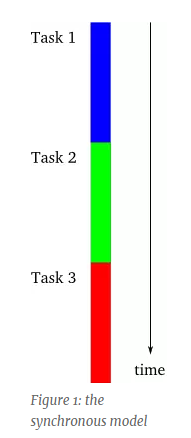
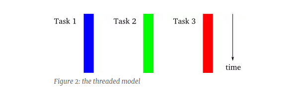
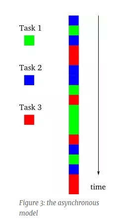

#### 前言

最近，有些人通过邮件形式紧急地寻求一份关于"Twisted Introduction"的资料，凭良心讲，这不是你想要的。

如果你是异步编程初学者，快速的Introduction也无济于事，除非你是天才。我已经使用Twisted框架很多年了，思考过初学的缓慢与艰难，并得出结论：其实真正的挑战并不是来自于Twisted本身，而是习得一种编写和理解异步编程(asynchronous code)的心智模型(mental model)，Twisted源码非常清晰明了，在线文档是以大多数自由软件为标准写的。 但是如果不掌握心智模型(mental model)，无论是读Twisted相关的代码，还是文档，都回相当困惑。

所以，第一部分就是帮你学习这种模型，之后才会介绍Twisted的特性。刚开始我们不会使用Twisted，而是通过简单的python编程来解释异步(asynchronous)系统是如何工作的，一旦我们开始走进Twisted，我们会从非常底层的方面开始，这些代码你可能在日常编程中都不会直接去编写和使用。Twisted是一个高度抽象的系统，提供了大量的手段和方法供你使用去解决问题。当你开始学习Twisted，尤其是试图理解Twisted实际是如何工作的时候，多层级的抽象会让你头大。所以，我们会由内而外，从最底层最基本的开始。

一旦你有了心智模型(mental model)，你会发现阅读Twisted文档和源码，会变的更加简单。

#### 模型

我们会从回顾两种熟悉的模型开始，并和异步模型进行对比。为了进行说明，假设一个程序(program)由三个在概念上明显不同的任务(task)组成，之后会让这些任务更加具体化，目前你需要知道程序必须执行他们就可以。

**第一种模型**：单线程同步模型(single-threaded synchronous model)，如下图(Figure 1)，这是一种最简单的编程模式，所有任务按严格地顺序执行，当执行到某一个任务时，可以肯定此前所有的任务都成功执行且没有出错。

**第二种模型**: 多线程同步模型(multi threaded synchronous model)，如下图(Figure2)。每个任务分别在不同的线程上执行，多线程由操作系统管理，可能有多个处理器或者多个核，真正的同时执行或者由单处理交替执行。关键是，多线程模型的执行细节由操作系统处理，编程者只需要认为不同指令同时执行即可。尽管图解很简单，实际上多线程编程相当复杂，因为涉及到线程间的合作。线程间的交流与合作属于一种高级编程的话题，理解起来也不是那么简单。

**异步模型**: 如图Fingure3, 所有任务交替执行，由一个线程控制，这种模式比多线程模式简单，因为每一个时刻永远只有一个任务在执行。尽管单处理器、单线程编程以一种交替模型进行执行，编程者可以用多线程模型进行思考，以免当程序移植到多线程系统时出错。单线程异步系统总是以交替模式执行，尽管放到多处理器系统上。

异步编程和多线程编程还有一个区别，在多线程系统中，挂起还是执行某个线程不能由程序员来控制，而是由操作系统来决定，你可以假定一个线程挂起且被其它线程取代发现在任何时候。相反，异步模式下，一个任务会继续执行直到它将控制权让渡给其它任务。注意，大家有可能把异步和多线程模型搞混，并将两者用于相同的系统上，而我们介绍的异步系统都是基于单线程的。

#### 动机

我们知道异步模型比多线程模型简单，因为其只有一个单一的指令流，当任务会明确的放弃其控制权而不是随机被挂起。但异步模型要比同步模型复杂一下，因为编程者必须将每个任务分成很小的部分，并交替进行执行。

